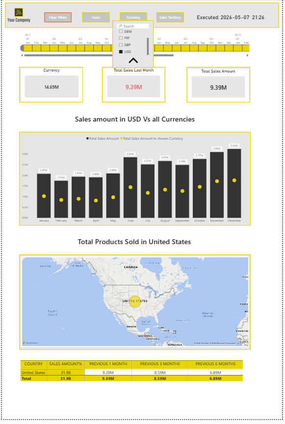
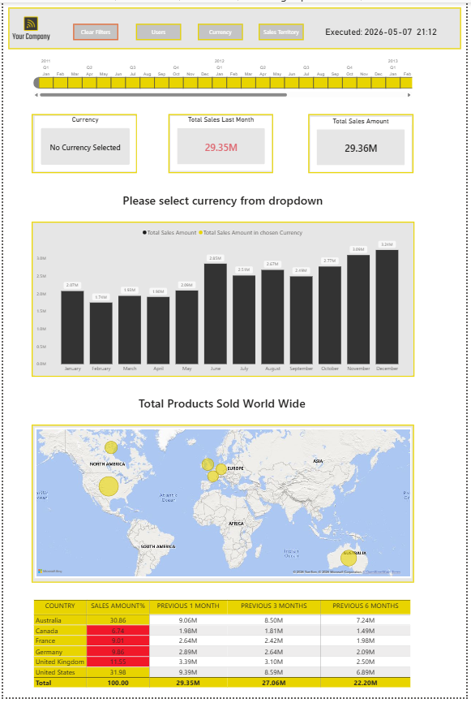
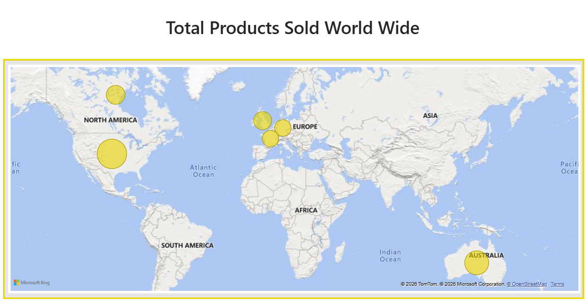
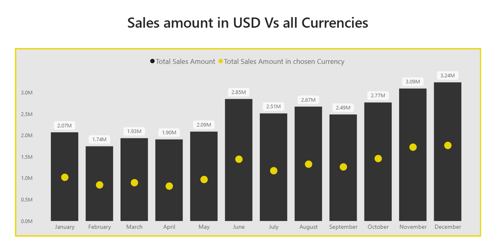
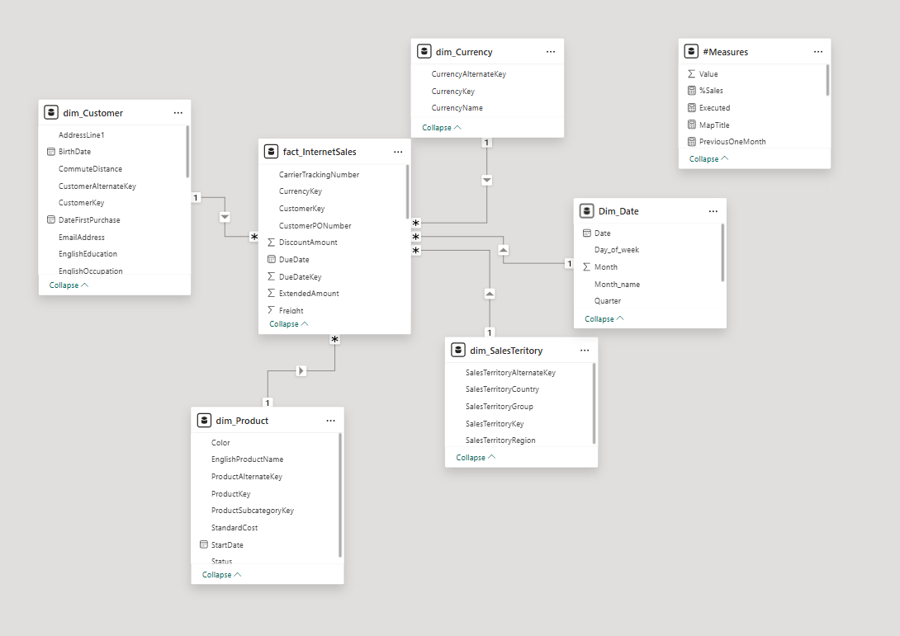

# GlobalSales360
Interactive Power BI dashboard for multi-currency, multi-region sales analytics. Features dynamic DAX measures, time-intelligence lookbacks, and geographic insights to drive smarter international sales decisions.
---

## 📊 Dashboard Overview

This report consists of **2 pages**:

### Page 1 — Summary View
A clean overview with a currency selector and a country-level sales history table.

### Page 2 — Main Dashboard
The full interactive experience, featuring:
- **KPI Cards** — Currency-converted sales, last month's sales, and total sales amount
- **Timeline Slicer** *(custom visual)* — Flexible date-range filtering
- **Slicers** — Filter by user, currency, and sales territory country
- **Line + Column Combo Chart** — Total sales (ALL currencies) vs. selected currency sales by month
- **Map Visual** — Geographic bubble map sized by products sold per country
- **Sales History Table** — Country-level breakdown with % of total sales and 1M / 3M / 6M lookback

---

## 🗂️ Data Model

| Table | Key Fields |
|---|---|
| `dim_Currency` | CurrencyAlternateKey |
| `dim_SalesTeritory` | SalesTerritoryCountry |
| `dim_Customer` | User_name |
| `Dim_Date` | Date, Month_name |
| `#Measures` | DAX measures (see below) |

### Key DAX Measures
- `SalesAmountSelectedCurrency` — Dynamic currency conversion
- `TotalSalesAmount` — Base total sales
- `TotalSalesAmountALL` — Sales ignoring currency/region filters (for comparison)
- `PreviousOneMonth`, `PreviousThreeMonth`, `PreviousSixMonth` — Time-intelligence lookbacks
- `%Sales` — Country share of total sales
- `ProductsSold` — Units sold per territory

---

## 🛠️ Tools & Technologies

- **Power BI Desktop**
- **DAX** (Data Analysis Expressions)
- **Power Query / M**
- Custom Visual: [Timeline by MAQ Software](https://appsource.microsoft.com/en-us/product/power-bi-visuals/WA104380943)

---

## 🚀 Getting Started

1. Clone or download this repository
2. Open `Sales_Currency_Region_Dashboard.pbix` in **Power BI Desktop**
3. Connect to your data source or use the embedded sample data
4. Publish to **Power BI Service** for sharing and scheduled refresh

```bash
git clone https://github.com/YOUR_USERNAME/sales-currency-region-dashboard.git
```

---

## 📁 File Structure

```
📦 GlobalSales360
 ┣ 📊 Sales_Currency_Region_Dashboard.pbix
 ┣ 📄 README.md
 ┗ 📁 screenshots/
    ┣ 🖼️ page1-summary.png
    ┣ 🖼️ page2-main.png
    ┣ 🖼️ map-visual.png
    ┣ 🖼️ combo-chart.png
    ┗ 🖼️ data-model.png
```

---

## 📸 Screenshots

### 🗂️ Page 1 — Summary View

> *Currency selector · KPI cards · Country sales history table*

### 📊 Page 2 — Main Dashboard

> *Full interactive dashboard with slicers, map, combo chart & table*

### 🗺️ Map Visual — Sales by Region

> *Geographic bubble map — bubble size = products sold per country*

### 📈 Combo Chart — Sales Trend

> *Total sales (ALL currencies) vs. selected currency sales by month*

### 🗃️ Data Model

> *Star-schema model — Currency, Geography, Customer, Date dimensions linked to the central fact/measures table*

---

## 📬 Contact

Feel free to connect on [LinkedIn]([https://linkedin.com/in/YOUR_PROFILE](https://www.linkedin.com/in/vedantratnakar/)) or raise an issue if you have questions or suggestions.

---

*Built with Power BI · DAX · Power Query*
